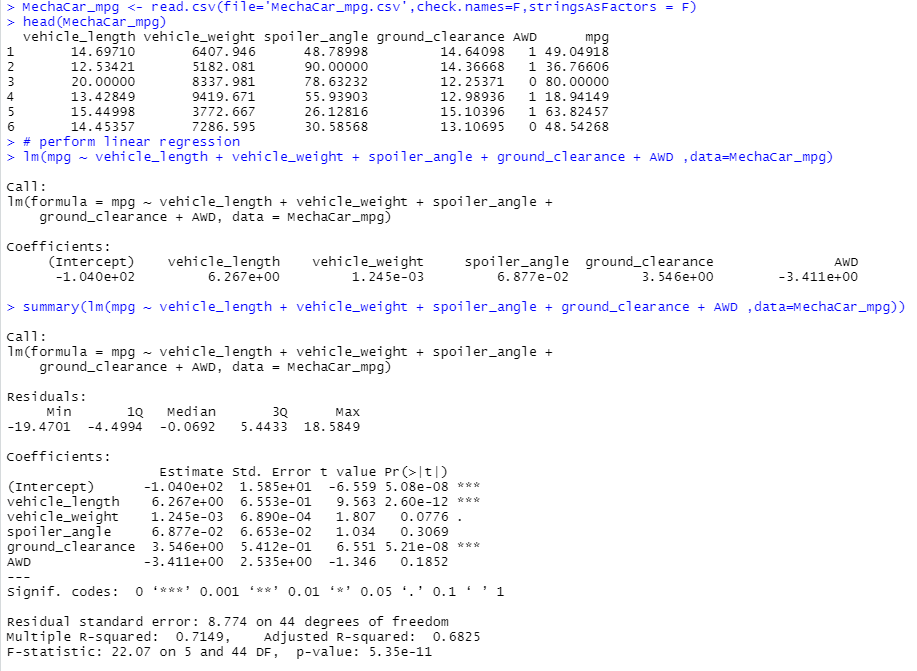
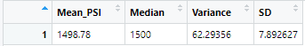
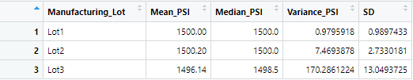
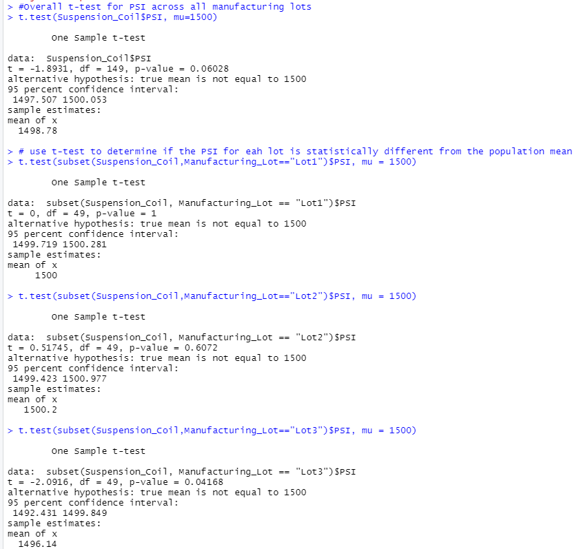

## Linear Regression to Predict MPG
•	A multiple linear regression analysis was performed on the MechaCar dataset in order to determine which variables in the dataset predict the mpg of the MechaCar prototypes. The dataset contains mpg test results of 50 prototype MechaCars. The dataset was imported and read as a dataframe. All six of the variables (i.e. columns) were passed through the linear regression function. From there, the summary fuction was used to determine the p-value and the r-squared value of the linear regression model. Looking at the coefficient values of each variable in the summary table, we can see that vehicle length, ground clearance, and AWD all fall below the 0.05p, indicating that these variables provide a non-random amount of variance to the mpg values.
•	The slope of the linear model cannot be considered zero due to the fact that the slope coefficients have p-values that are less than the p=0.05, shown below:
vehicle length: 5.08e-12
vehicle weight: 2.60e-12
spoiler angle: 0.0776
ground clearance: 5.21e-08
AWD: 0.1852
•	The linear model does a good job at predicting the mpg of MechaCar prototypes. The r-squared value for this model is 0.7149. This indicates that roughly 71.5% of the variability of the dependent model was shown through this linear model. 

## Summary Statistics on Suspension Coils

•	MechaCar has a design specification for the suspension coils that dictate the variance of the suspension coils must not exceed 100 pounds. To verify that the current manufacturing data meets this design specification for all manufacturing lots, a total_summary database was created. Looking at this, we can see that there is a variance of 62.29356. While this falls below the 100 pounds, it is higher than what is anticipated. 
•	To get a further understanding of why the variance was so high, an R script was written to group each manufacturing lot by mean, median, variance and standard deviation of the suspension coil’s PSI column. This summary table showed that the main contributor for the high variance is the third lot, which has a variance of 170.2861224, which is more than the design specification. This manufacturing lot should be addressed to handle the issue. 

##  T-Test on Suspension Coils

•	A T-Test was performed all on 3 lots in order to determine if all manufacturing lots and each lot individually are statistically different from the population mean of 1,500 pounds per square inch. 
•	The initial T-Test included all three lots and resulted in a p value of p = 0.06028 which is > 0.05 and indicates that together, the total manufacturing lot is not statistically different from the population mean. 
•	The T-Test for lot 1 resulted in a p value of p = 1, which is also > 0.05, meaning that lot 1 was not statistically different from the population mean. 
•	Lot 2 had a p-value of 0.6072 > 0.05 and is not statistically different from the population mean.
•	Lot 3, however, produced a p-value of 0.04168 < 0.05 and is statistically different and we are unable to reject the null hypothesis.

## Study Design: MechaCar vs Competition

To compare the performance of the MechaCar against its competitors, there are several metrics that could be considered. There are several features of a car that influences whether or not a consumer would want to purchase, such as cost, passenger capacity, safety rating, highway/city fuel efficiency, comfort, and amenities.

1)	The metrics that would be used for this study would have cost, passenger capacity, safety rating, highway/city fuel efficiency, comfort, and amenities.
2)	The null hypothesis for this is that the highway/city fuel efficiency is similar to the competitors. The alternative hypothesis is that either MechaCar or the competitor would be statistically higher or lower than the other. 
3)	Similar to the study done for this project, a linear regression model, a summary and a tw-sample T-test would be best for this analysis.
4)	Also similar to this study, a random sample of about 50 vehicles form both parties would need to be taken. The information collected should include the metrics proposed for this study.
